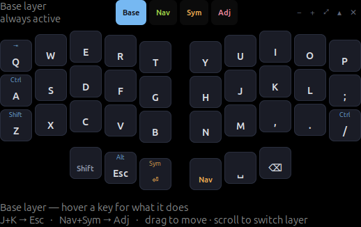

# ZMK cheat sheet overlay

A small always-on-top window that renders `config/corne.keymap` as a cheat
sheet, so you can learn the layout without alt-tabbing to a diagram.

It parses the keymap file itself — there is no second copy of the layout to
keep in sync. Edit the keymap and the overlay redraws within a moment.

```
./tools/keymap-overlay/zmk-cheatsheet
```



## What it shows

- All four layers (Base, Nav, Sym, Adj), one at a time, on the real 5-column
  Corne shape including the column stagger and the thumb clusters.
- Hold behaviours in small blue text above the tap legend, so `A` reads as
  *Ctrl on hold, A on tap*.
- Layer keys in amber, macros in green, Bluetooth/reset keys in pink, and
  `&trans` keys greyed out to `▽`.
- Under the title, how to reach the layer you are looking at — e.g.
  `hold ⏎ · left thumb` for Sym.
- The combos and conditional layers along the bottom (`J+K → Esc`,
  `Nav+Sym → Adj`).
- Hover any key for the full story, including hold-tap timings:
  `tap A · hold Left Ctrl — hm (balanced, 200 ms hold, disabled within 150 ms of a keypress)`

## Using it

| | |
|---|---|
| drag anywhere | move the window |
| scroll | previous / next layer |
| layer tabs | jump to a layer |
| `−` `+` | more / less transparent |
| `⤢` | cycle size (0.85 → 1.0 → 1.2 → 1.45) |
| `▴` | collapse to a title strip that still switches layers |
| `✕` | quit |

Position, layer, opacity and size are remembered in
`~/.config/zmk-cheatsheet/state.json`.

The window deliberately never takes keyboard focus, so clicking it does not
interrupt whatever you were typing into. Pass `--focus` if you would rather
have keyboard shortcuts (`1`–`4` for layers, `+`/`-`, `s` for size, `q` to
quit).

## Does it follow my edits?

Yes. The overlay watches the keymap file and redraws within a moment of any
save — no restart, no rebuild, and nothing to keep in sync by hand. It watches
both the file and its directory, so editors that save by writing a temp file
and renaming over the original are picked up too.

Two things it cannot see:

- **ZMK Studio edits.** This config has `CONFIG_ZMK_STUDIO=y`, and changes made
  live at [zmk.studio](https://zmk.studio) go into the keyboard's settings, not
  into `config/corne.keymap`. The overlay reads the file, so Studio-only changes
  will not show up until you write them back into the keymap.
- **What layer the keyboard is on right now.** Layer state never leaves the
  firmware — the host only ever receives the resulting keycodes. The nice!view
  screens on the keyboard already show the active layer; this overlay shows
  whichever layer you have selected in it.

## Options

```
zmk-cheatsheet [path/to/file.keymap] [options]
  --dump         print the cheat sheet to the terminal and exit
  --html [FILE]  write a standalone HTML cheat sheet and exit
  --ascii        plain-text glyphs, for hosts without a Unicode font
  --focus        let the overlay take keyboard focus (1-4, +/-, s, q)
  --scale N      0.85 | 1.0 | 1.2 | 1.45
```

With no path it walks up from the script looking for a `config/*.keymap`, so
running it from anywhere in this repo just works.

`--html` writes one self-contained page with every layer stacked, which is the
fallback for any environment where a floating window is awkward:

```
./tools/keymap-overlay/zmk-cheatsheet --html corne-cheatsheet.html
```

`--dump` prints the same cheat sheet to the terminal and exits — handy over
SSH or for a quick diff after editing the keymap:

```
$ ./tools/keymap-overlay/zmk-cheatsheet.js --dump
── Base  (layer 0) ───────────────────────────────
  Q(⇥)      W         E         R         T            Y  U  I  O  P
  A(Ctrl)   S         D         F         G            H  J  K  L  ;
  ...
```

## Install

```
./tools/keymap-overlay/install.sh              # add it to the GNOME app grid
./tools/keymap-overlay/install.sh --autostart  # ...and start it at login
```

## Requirements

`gjs` and GTK 3. Both are present by default on Ubuntu GNOME; on a minimal
install:

```
sudo apt install -y gjs gir1.2-gtk-3.0 fonts-dejavu-core
```

The launcher checks for all of this up front and tells you exactly what is
missing rather than failing obscurely.

Always-on-top and the remembered window position need X11 — that is what
`_NET_WM_STATE_ABOVE` and client-side window placement require. Under Wayland
the overlay still runs and everything else works, but stacking and placement
belong to the compositor; the launcher says so on startup.

## Windows / WSL

It runs under WSL 2 through WSLg, which ships with Windows 11 and recent
Windows 10 and needs no X server of your own:

```
sudo apt update && sudo apt install -y gjs gir1.2-gtk-3.0 fonts-dejavu-core
./tools/keymap-overlay/zmk-cheatsheet
```

If `echo $DISPLAY $WAYLAND_DISPLAY` comes back empty, run `wsl --update` and
`wsl --shutdown` from PowerShell and reopen the distro.

Two caveats specific to WSL, both reported by the tool rather than left to
surprise you:

- **Always-on-top is not guaranteed.** WSLg presents Linux windows as ordinary
  Windows windows and the compositor owns their stacking, so the request to
  stay above other windows may be ignored. If it is, pin the window with a
  Windows utility, or use `--html` and keep the page in a pinned browser tab.
- **Fonts.** A minimal WSL image may not have a font covering `⏎ ⌫ ⇧ ⌥`, which
  renders as empty boxes. `fonts-dejavu-core` fixes it; `--ascii` avoids the
  question entirely by using `Ent`, `Bksp`, `S-`, `A-` and friends.

For WSL 1, or if you would rather not deal with WSLg at all, `--html` writes a
page you can open from Windows:

```
./tools/keymap-overlay/zmk-cheatsheet --html /mnt/c/Users/<you>/corne.html
```

## Extending it

The keymap is parsed into a plain object (layers, behaviors, macros, combos,
conditional layers) and each binding is turned into `{tap, hold, kind, detail}`
by `resolve()`. Teaching it a new behaviour means adding one `case` there —
`&kp`, `&mo`, `&lt`, `&mt`, `&bt`, `&out`, `&sys_reset`, `&bootloader`, any
`zmk,behavior-hold-tap`, and any macro are already handled.
